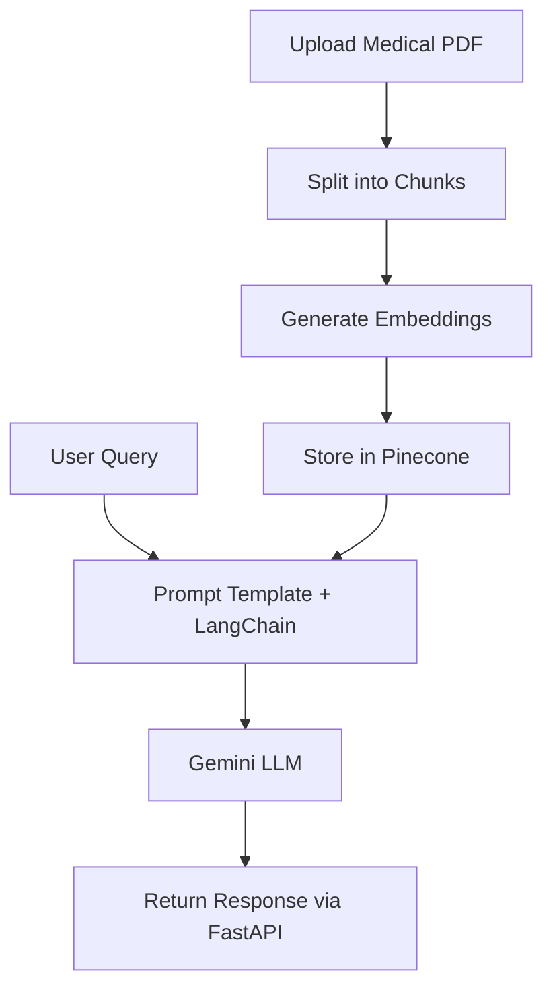

# 🧬 MediVerse – AI-Driven Medical Bot

**MediVerse** is a powerful, intelligent chatbot built using **FastAPI** and powered by **LangChain**, **Pinecone**, and **Google Gemini**. It processes complex medical PDFs, generates embeddings, and enables human-like Q\&A based on deep semantic understanding.

> ⚕️ *Next-gen digital healthcare assistant at your fingertips.*


---

## 🚀 Features

* 📄 PDF ingestion & chunking
* 🧬 Embedding generation with OpenAI
* 🔗 Vector storage in Pinecone
* 🔍 Semantic retrieval with LangChain
* 🧠 Dynamic responses from Google Gemini Pro
* ⚡ Built with blazing-fast **FastAPI**

---

## 🧠 How It Works



---

## 🛠 Tech Stack

* Python 3.10 🐍
* **FastAPI** ⚡
* **LangChain** 🧠
* **OpenAI Embeddings**
* **Pinecone** for vector search 🔍
* **Google Gemini LLM** 🔮

---

## 🧪 Getting Started

### 1️⃣ Clone the Repo

```bash
git clone https://github.com/your-username/mediVerse.git
cd mediVerse
```

---

### 2️⃣ Setup Virtual Environment

```bash
conda create -n medibot python=3.10 -y
conda activate medibot
```

---

### 3️⃣ Install Requirements

```bash
pip install -r requirements.txt
```

---

### 4️⃣ Set Up Environment Variables

Create a `.env` file in the root:

```ini
PINECONE_API_KEY="your-pinecone-key"
GOOGLE_API_KEY="your-google-api-key"
```

---

### 5️⃣ Build the Vector Index

```bash
python store_index.py
```

This loads PDFs → splits into chunks → creates embeddings → stores in Pinecone.

---

### 6️⃣ Launch the API

```bash
uvicorn app:app --reload
```

> Open in browser: [http://127.0.0.1:8000/docs](http://127.0.0.1:8000/docs) to explore the auto-generated Swagger UI.

---

## 💡 Use Cases

* 🤖 Personal AI health assistants
* 📚 Medical document Q\&A
* 🏥 Hospital support bots
* 🧾 Research paper analyzers

---

## ⚠️ Disclaimer

MediVerse does **not** provide medical advice. It is a research prototype and should not be used for diagnosis or treatment.

---

## 🤝 Contribute

PRs, ideas, and issues welcome. Let’s build the future of AI in healthcare together.

